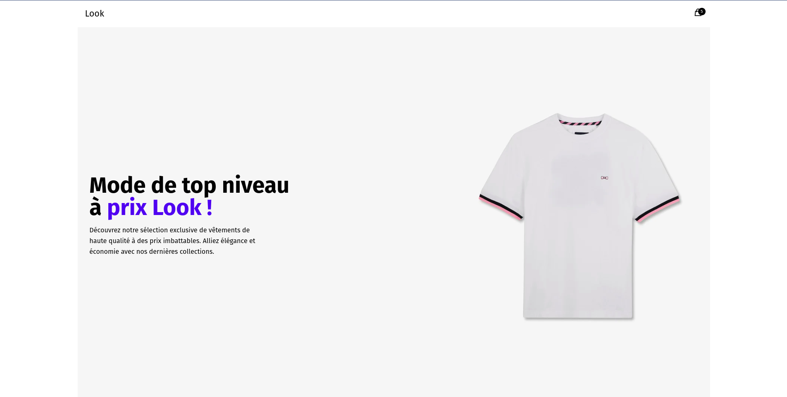

# Projet Look E-commerce



## Description

Ce projet est une application web de type e-commerce développée principalement pour pratiquer et démontrer les compétences en React et React Router DOM. Il s'agit d'un projet entièrement frontal (full frontend) qui simule une boutique en ligne où les utilisateurs peuvent explorer différents articles de mode.

Le projet a été construit en utilisant [Bun](https://bun.sh/), un runtime JavaScript moderne et rapide, qui permet une expérience de développement efficace et une performance optimale de l'application.

## Fonctionnalités

- Navigation entre les pages avec React Router DOM
- Affichage des articles de mode
- Sélection et visualisation des détails des articles
- Interface réactive adaptée à tous les types d'appareils

## Prérequis

Avant de lancer le projet en local, assurez-vous d'avoir installé [Bun](https://bun.sh/) sur votre machine. Bun est nécessaire pour exécuter le serveur de développement et construire le projet.

## Installation et lancement

Suivez ces étapes pour télécharger et lancer le projet Look E-commerce sur votre machine locale :

1. Clonez le dépôt du projet :

```bash
bun create look-e-commerce
```

2. Accédez au dossier du projet :

```bash
bun create look-e-commerce
```

3. Installez les dépendances du projet :

```bash
bun install
```

4. Installez les dépendances du projet :

```bash
bun run start
```

Après avoir exécuté ces commandes, le projet sera accessible à l'adresse [http://localhost:3000](http://localhost:5173) dans votre navigateur.

## Contribution

Les contributions au projet sont les bienvenues. Si vous souhaitez contribuer, n'hésitez pas à forker le dépôt, apporter vos modifications et soumettre une pull request.

---

Bonne exploration et développement avec le projet Look E-commerce !
```
